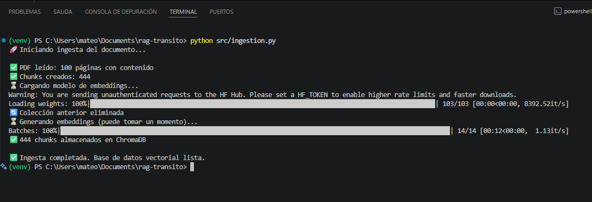
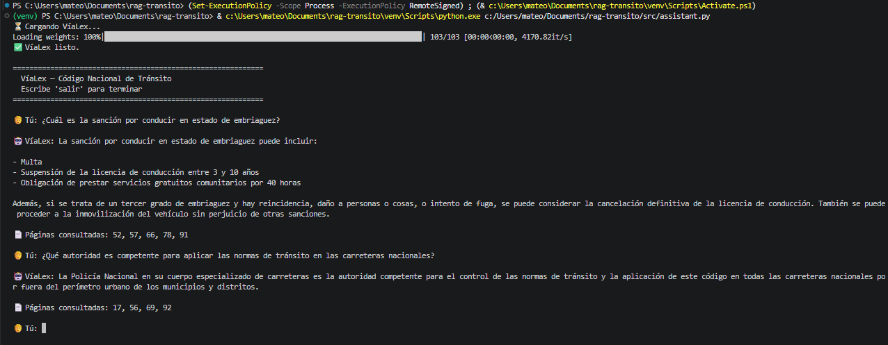
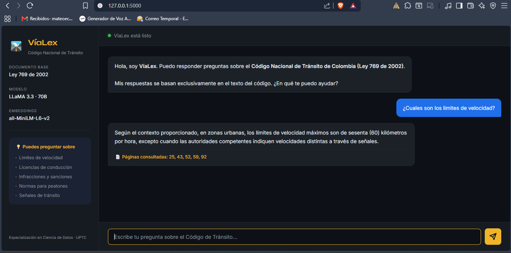
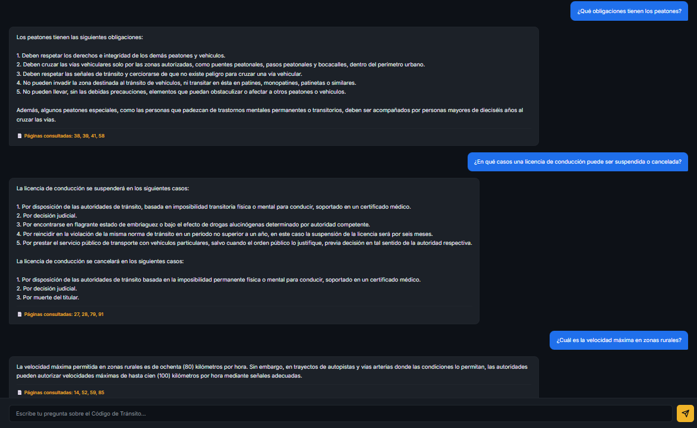
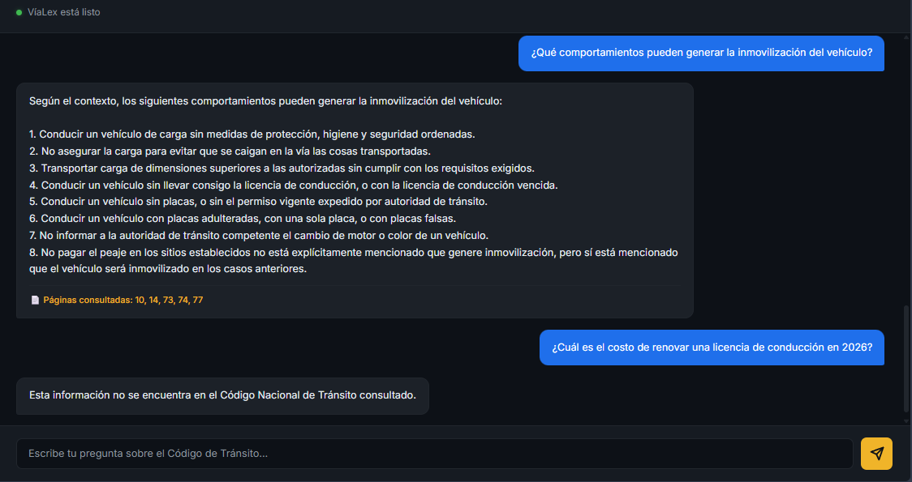
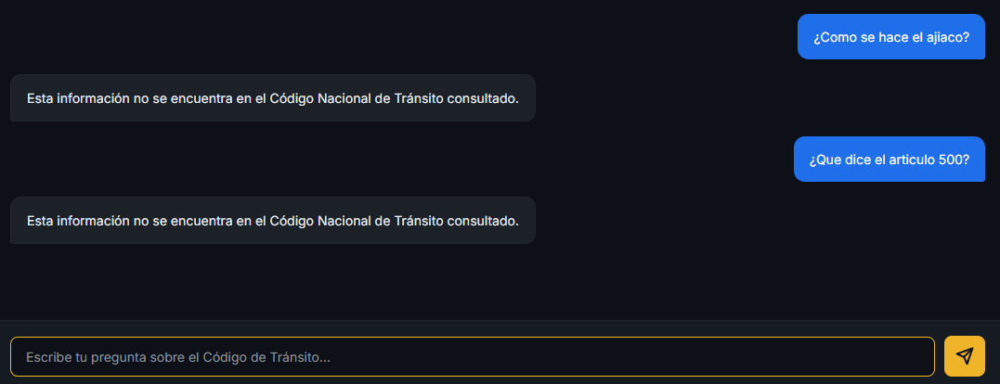

# 🛣️ VíaLex — Asistente RAG sobre el Código Nacional de Tránsito de Colombia


---

## 👤 Información del estudiante

| Campo | Detalle |
|---|---|
| **Nombre** | Mateo Augusto Echeverría González |
| **Institución** | Universidad Pedagógica y Tecnológica de Colombia — UPTC |
| **Programa** | Especialización en Programación para Ciencia de Datos |
| **Fecha** | Junio 2025 |

---

## 📄 Documento seleccionado

**Código Nacional de Tránsito Terrestre — Ley 769 de 2002**

**Justificación:** Es un documento legal de uso cotidiano para cualquier ciudadano colombiano, con contenido técnico-jurídico estructurado y más de 100 páginas de normativa real. Su consulta tradicional es difícil por su extensión y lenguaje formal, lo que hace de un asistente RAG una solución de alto valor práctico. Además, cubre temáticas variadas (infracciones, licencias, señales, peatones, velocidades) que permiten evaluar con amplitud las capacidades de recuperación semántica del sistema.

---

## 🎯 Persona usuaria objetivo y caso de uso

**Persona:** Ciudadano colombiano conductor o peatón sin formación jurídica.

**Caso de uso:** Consultar en lenguaje natural las normas de tránsito que aplican a situaciones cotidianas — límites de velocidad, requisitos de licencias, sanciones, normas de comportamiento vial, definiciones legales — sin necesidad de leer el código completo ni conocer la terminología legal exacta.

---

## 🏗️ Arquitectura del sistema
PDF (Ley 769/2002)

│

▼

PyMuPDF + LangChain

(extracción y chunking)

│

▼

sentence-transformers

(embeddings locales)

│

▼

ChromaDB

(BD vectorial)

│

┌────┴────┐

│         │

Terminal  Flask

│         │

└────┬────┘

│

Pregunta usuario

│

▼

Búsqueda semántica

(Top-K chunks)

│

▼

LLaMA 3.3 70B

(via Groq API)

│

▼

Respuesta con páginas
---

## ⚙️ Tecnologías utilizadas

| Componente | Tecnología |
|---|---|
| Extracción de texto | PyMuPDF (`fitz`) |
| Chunking inteligente | LangChain `RecursiveCharacterTextSplitter` |
| Embeddings | `sentence-transformers` — all-MiniLM-L6-v2 |
| Base de datos vectorial | ChromaDB (persistente local) |
| Modelo de lenguaje | LLaMA 3.3 70B via Groq API |
| Interfaz web | Flask + HTML/CSS vanilla |
| Interfaz terminal | Python loop |
| Gestión de variables | python-dotenv |

---

## 🖥️ Instrucciones para ejecutar el sistema

### 1. Requisitos previos
- Python 3.9 o superior
- API Key de Groq — obtener gratis en [console.groq.com](https://console.groq.com)
- El archivo `codigo_transito.pdf` dentro de la carpeta `data/`

### 2. Clonar el repositorio
```bash
git clone https://github.com/MateoEG3/APP-RAG-CODIGO-DE-TRANSITO.git
cd APP-RAG-CODIGO-DE-TRANSITO
```

### 3. Crear y activar entorno virtual
```bash
python -m venv venv

# Windows
venv\Scripts\activate

# Mac/Linux
source venv/bin/activate
```

### 4. Instalar dependencias
```bash
pip install -r requirements.txt
```

### 5. Configurar API Key
Crear archivo `.env` en la raíz del proyecto:
GROQ_API_KEY=tu_api_key_aqui

### 6. Ejecutar la ingesta (solo la primera vez)
```bash
python src/ingestion.py
```


### 7. Ejecutar el asistente

**Opción A — Interfaz web (Flask):**
```bash
python app.py
```
Luego abre el navegador en `http://localhost:5000`

**Opción B — Terminal:**
```bash
python src/assistant.py
```

---

## 💬 Cinco preguntas y respuestas generadas por el sistema

### Pregunta 1 — ¿Qué obligaciones tienen los peatones?

> Según el Código Nacional de Tránsito, los peatones tienen las siguientes obligaciones:
> 1. Deben respetar los derechos e integridad de los demás peatones y vehículos.
> 2. Deben cruzar las vías vehiculares solo por las zonas autorizadas (puentes peatonales, pasos peatonales y bocacalles) dentro del perímetro urbano.
> 3. Deben respetar las señales de tránsito y cerciorarse de que no existe peligro para cruzar una vía vehicular (Artículo 57).
> 4. No pueden invadir la zona destinada al tránsito de vehículos, ni transitar en patines, monopatines o similares (Artículo 58).
> 5. Los peatones que incumplan pueden ser sancionados con una multa de un salario mínimo legal diario vigente (Parágrafo 2°).
>
> 📄 Páginas consultadas: 38, 39, 41, 58

---

### Pregunta 2 — ¿En qué casos una licencia de conducción puede ser suspendida o cancelada?

> Una licencia puede ser suspendida o cancelada por:
> 1. Imposibilidad física o mental para conducir, soportada en certificado médico.
> 2. Decisión judicial.
> 3. Flagrante estado de embriaguez o bajo efecto de drogas alucinógenas (suspensión de 8 meses a 1 año).
> 4. Reincidir en la violación de la misma norma de tránsito.
> La suspensión implica la entrega obligatoria del documento a la autoridad de tránsito competente.
>
> 📄 Páginas consultadas: 26, 27, 28, 65, 79

---

### Pregunta 3 — ¿Cuál es la velocidad máxima permitida en zonas rurales?

> La velocidad máxima en zonas rurales es de 80 km/h. En autopistas y vías arterias donde las condiciones de diseño lo permitan, las autoridades pueden autorizar hasta 100 km/h, indicándolo con señales adecuadas.
>
> 📄 Páginas consultadas: 14, 46, 47, 59

---

### Pregunta 4 — ¿Qué comportamientos pueden generar la inmovilización del vehículo?

> Los comportamientos que pueden generar inmovilización son:
> - Conducir sin placas o sin permiso vigente de autoridad de tránsito.
> - Conducir con placas adulteradas o falsas.
> - Conducir con una sola placa.
> - No informar a la autoridad el cambio de motor o color del vehículo.
> La autoridad competente para ordenar la inmovilización es el agente de tránsito.
>
> 📄 Páginas consultadas: 2, 14, 47, 74, 76

---

### Pregunta 5 — ¿Cuál es el costo de renovar una licencia de conducción en 2026?

> Esta información no se encuentra en el Código Nacional de Tránsito consultado.
>
> *(El sistema responde correctamente — los costos administrativos actualizados no hacen parte del texto de la Ley 769 de 2002. VíaLex no inventa información.)*

---

## 📸 Demostración

### Ingesta del documento


### Asistente en terminal


### Interfaz web — respuestas del sistema




### Rechazo de pregunta fuera del documento


---

## ⚠️ Limitaciones del sistema

- El chunking por caracteres puede partir artículos importantes a la mitad, perdiendo contexto clave en algunas consultas.
- El sistema depende del match semántico entre la pregunta y el texto del documento — preguntas con vocabulario muy diferente al del código pueden no recuperar contexto relevante aunque la información esté en el PDF.
- Los valores monetarios y costos administrativos del código pueden estar desactualizados respecto a la normativa vigente en 2025.
- No tiene memoria conversacional — cada pregunta se procesa de forma independiente.

---

## 📁 Estructura del proyecto

APP-RAG-CODIGO-DE-TRANSITO/

├── data/

│   └── codigo_transito.pdf

├── src/

│   ├── ingestion.py       # Carga, chunking, embeddings y ChromaDB

│   ├── rag.py             # Lógica RAG compartida

│   └── assistant.py       # Interfaz de terminal

├── templates/

│   └── index.html         # Interfaz web

├── static/

│   └── style.css          # Estilos

├── assets/                # Screenshots para el README

├── app.py                 # Servidor Flask

├── render.yaml            # Configuración de despliegue

├── requirements.txt

├── .env                   # No se sube a GitHub

├── .gitignore

└── README.md

